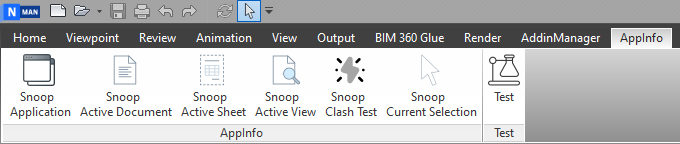
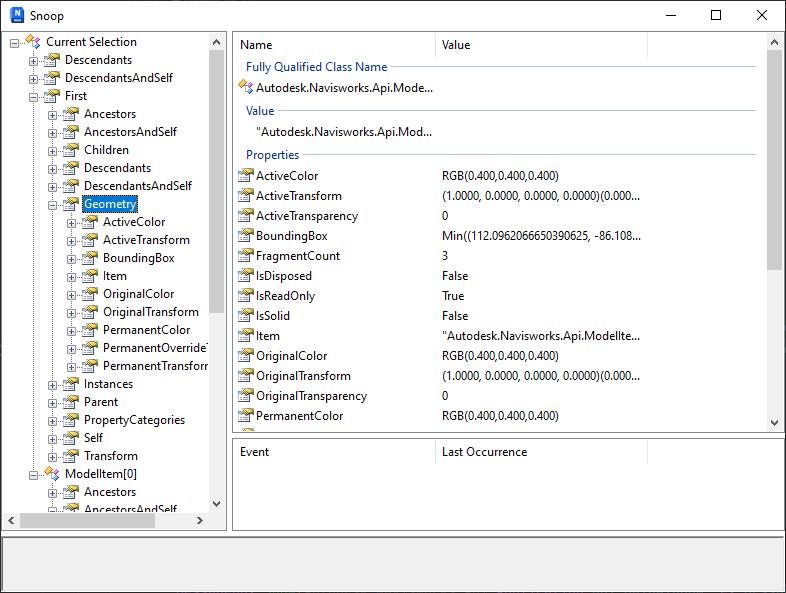

# Navisworks App Info

  

   

## Summary

The project supports quick lookup of results to help programmers work effectively with Navisworks. Originally this was a
research project developed by Autodesk team, but now they need to be fixed and improved a lot, so I decided to rebuild
and maintain it to help.Easy to use by programmers for the purposes of creating tools for the AEC industry.

## App Info

### Some feature include:

- Snoop current selection
- Snoop Application
- Snoop Active Document
- Snoop Active View
- Snoop Active Sheet
- Snoop Clash Test

## Installation

Please follow last release at section [Release](https://github.com/chuongmep/NavisAppInfo/releases/latest)

Support Navisworks Version : 2020, 2021, 2022, 2023.
---

## Guideline

You can visit to wiki and read document or access by this [link](https://github.com/chuongmep/NavisAppInfo/wiki).

---

## Author

Originally implemented by [ChuongHo](https://github.com/chuongmep) with platform **WPF** and add more feature to fit
with the progressive development of modern technology. His focus is to work smarter and achieve the most effective
practices to enhance data utilization and digital collaboration among AEC parties.

---

## License

This sample is licensed under the terms of the [MIT License](http://opensource.org/licenses/MIT). Please see
the [License](License.md) file for full details.

© 2009 Autodesk, Inc. All rights reserved. All use of this Software is subject to the terms and conditions of the Autodesk End User License Agreement accepted upon installation of this Software and/or packaged with the Software.

---

## Contribute

**Navisworks App Info** is an open-source project and would _be_ nothing without its community. You can make suggestions
or
track and submit bugs via
Github [issues](https://docs.github.com/en/issues/tracking-your-work-with-issues/creating-an-issue). You can submit your
own code to the **Navisworks App Info** project via a
Github [pull request](https://docs.github.com/en/pull-requests/collaborating-with-pull-requests/proposing-changes-to-your-work-with-pull-requests/about-pull-requests)
.

Many Thanks all contributors for this repository. Feel free to contribute!
Please refer to the [CONTRIBUTING](CONTRIBUTING.md) for details.

---

## Sponsors

Thanks for providing a free All product IDE for this project

---

## Credits

- Credit to [chuongmep](https://github.com/chuongmep) origin maintain for this project.
- Credit to [Nice3point](https://github.com/Nice3point) for the CI/CD template.

--- 

## Learning Resouces

- [Navisworks Developer Center](https://www.autodesk.com/developer-network/platform-technologies/navisworks)
- [adndevblog](https://adndevblog.typepad.com/aec/navisworks/)
- [Autodesk Navisworks Forum](https://forums.autodesk.com/t5/navisworks/ct-p/4)
- [Navisworks API Docs](https://apidocs.co/apps/navisworks/2018/87317537-2911-4c08-b492-6496c82b3ed0.htm)
- [Navisworks API Open Source](https://github.com/topics/navisworks-api)
- [Navisworks Nuget](https://www.nuget.org/packages?q=chuongmep.navis)
